<audio src="small_small_love_song.mp3" controls="controls" autoplay loop></audio>

 
 
 
 

# 親愛的老婆

## 生日快樂。

好多想說卻總是來不及記下。認識妳、交往、衝墾丁、結婚然後有謝寶謝妞、一起旅行了好多地方 (印尼峇厘島、印尼普吉島、馬來西亞、長灘島、沖繩、石垣島、墾丁、泳渡日月潭、宜蘭、花蓮、台東、台南、嘉義、小琉球...to be continued)。
` `
` `

##### 峇厘島

##### 墾丁七孔瀑布

##### 馬來西亞 (阿洲婚禮)

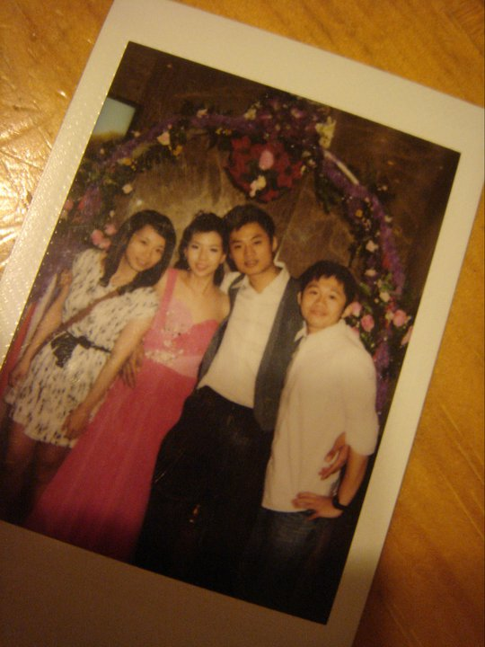

##### 長灘島 (微蜜月)

##### OKINAWA (妳腿好長)

##### 石垣島 (小孩薯條冰淇淋吃到飽)

##### 台南SUP (Typical Ethan Style)

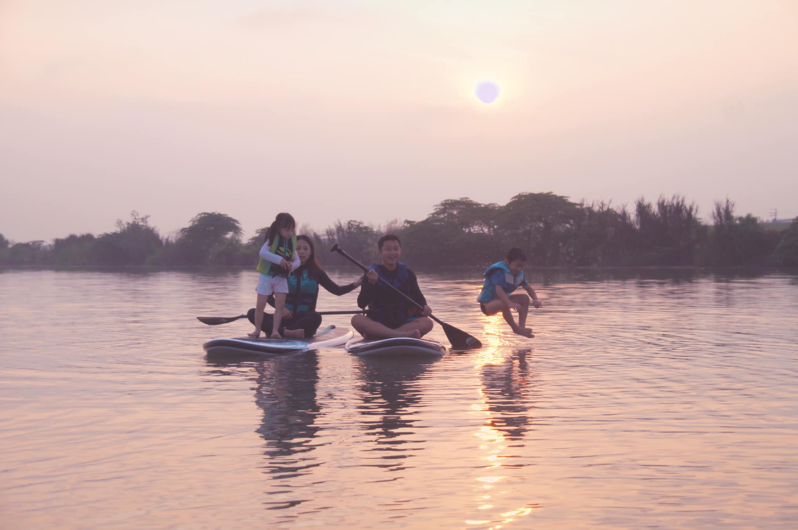
 
 
一轉眼已經十年了，真是不可思議且美好的過程，未來也請多多指教。
 
 

##### 好美的妳

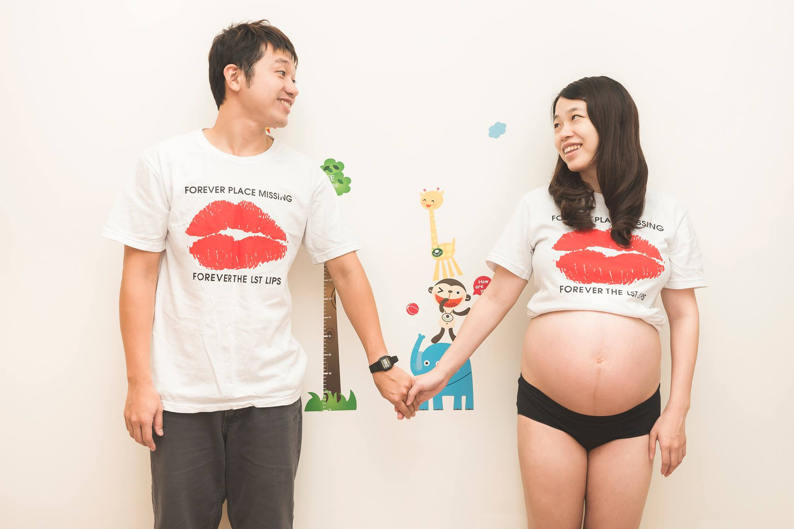

##### My Queen And Princess

##### Hey, You Are My World

##### Dear, Dear, We All Love You

##### Mommy and Me

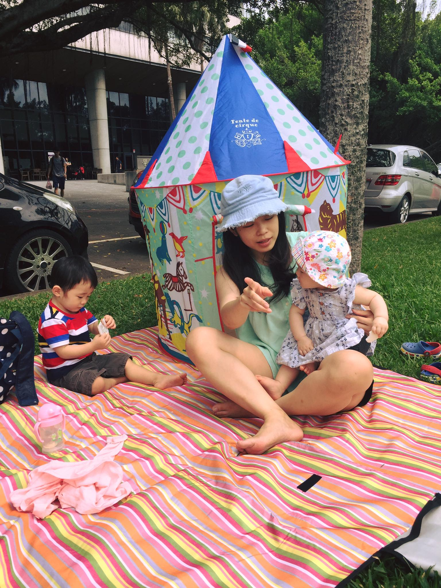

##### 愛水的我們

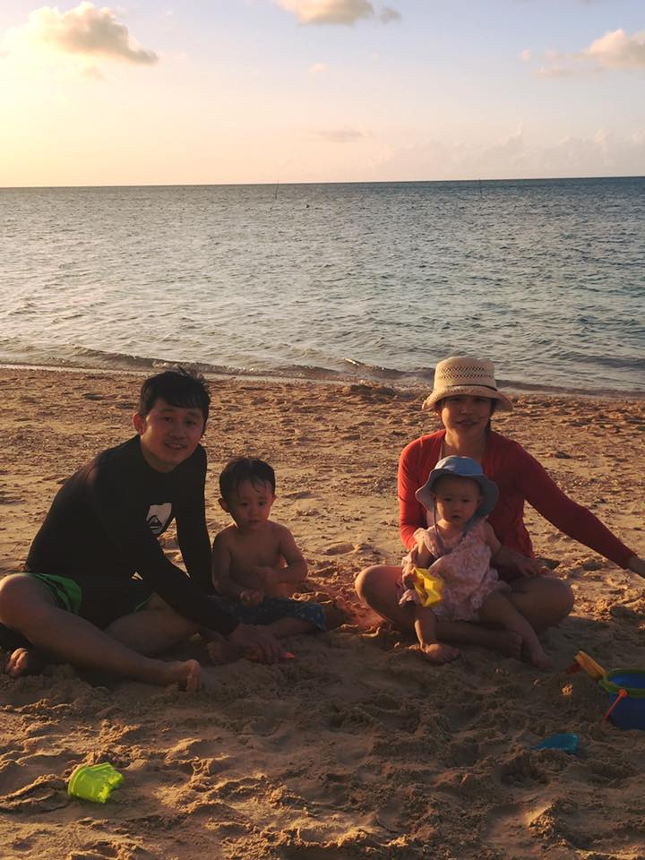

##### HOME! We Build Our Home! Sweet Home!

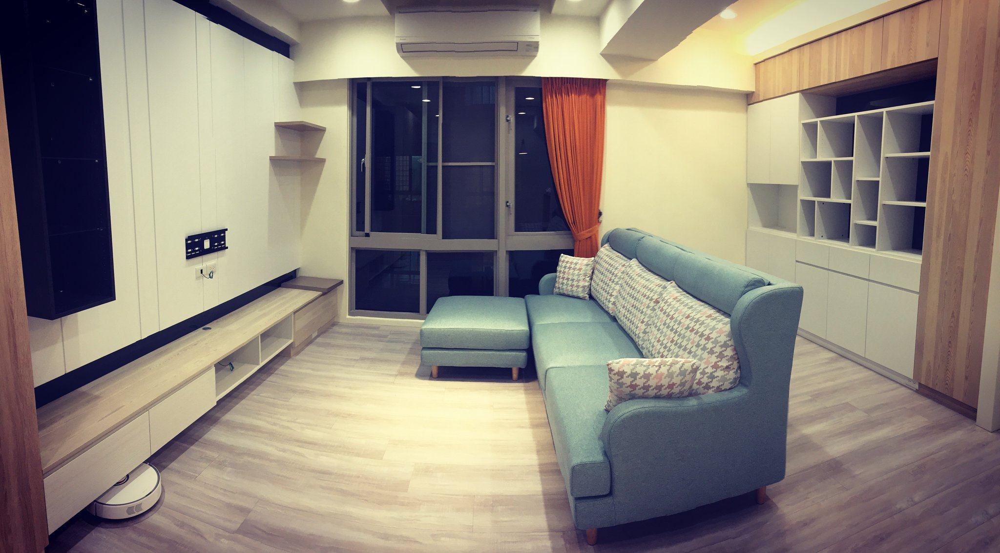
 
 
你總是節儉，總是喜愛照相留念、總是安排旅遊、總是購買家裡大小雜物。感謝妳的辛勞，無私的奉獻、照顧、愛護我、謝寶、謝妞，也希望妳不要忘記愛自己，雖然已經開始去旅遊時到飯店先SPA了。
 
 

##### 哈囉墾丁

 
 
感謝妳讓我在這個年紀可以真的開始真誠坦白的認真面對自己，過生活。當討論夫妻分別財產制時，反而更篤定比以往任何時刻都認真地面對婚姻，當然偶爾大小吵，但我會真摯並努力的經營我們的感情及婚姻，常常保有戀愛的感覺，也謝謝妳很努力的的包容調整磨合。謝謝妳愛我。
 
 

##### 好年輕的我們

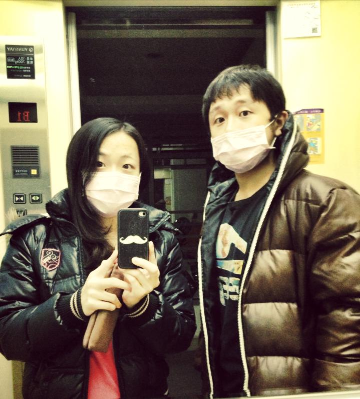

##### Hey, Let's Marry

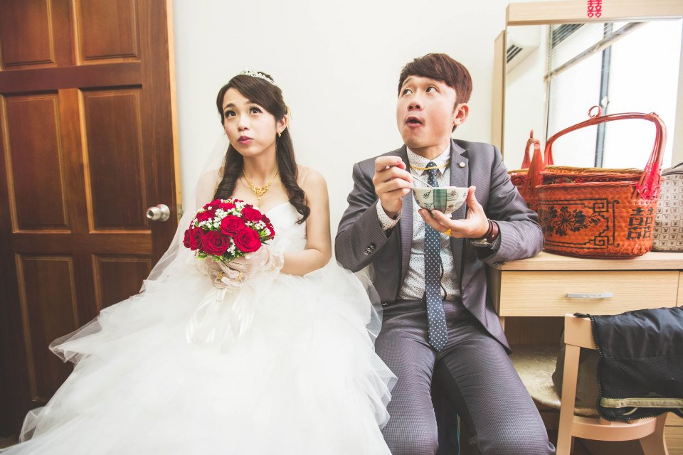

##### 婚紗照當然也要墾丁一下

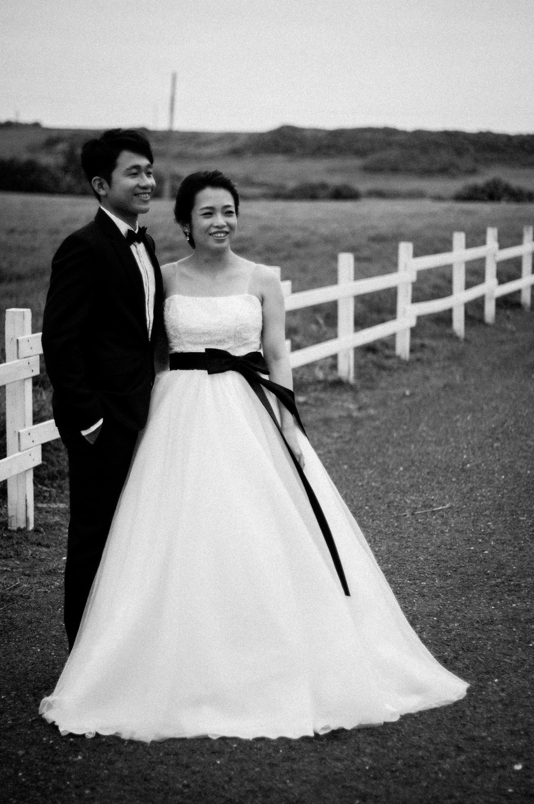

 
 
感謝兒子女兒努力做好自己，讓我們學習做父母，更讓我不停的內省，探索自己內心，並且成長。
 
 

##### 有人慢一拍

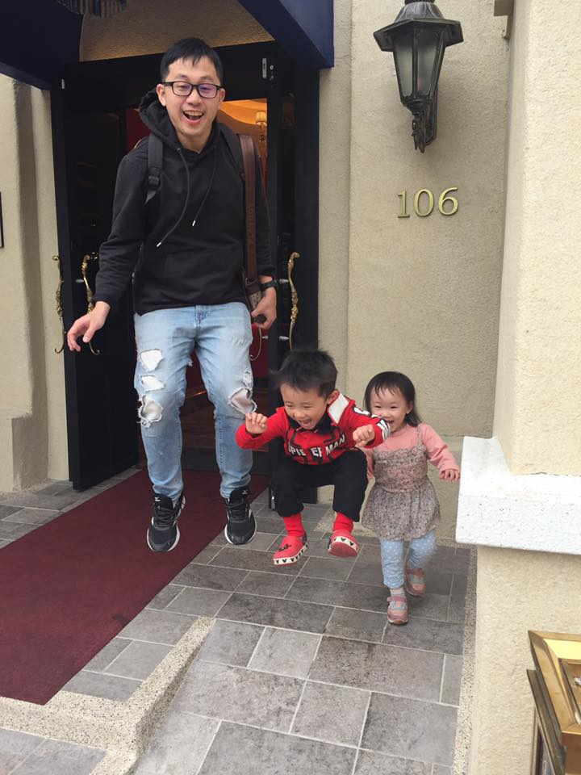

##### 中間那位...

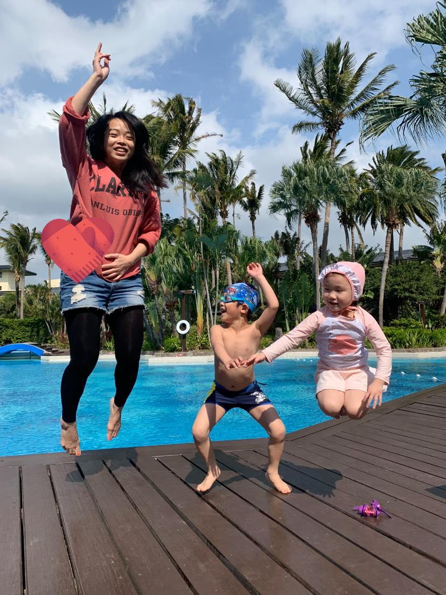

##### 很愛的全家福照片

 
 

感謝爸媽、岳母、阿媽，借用妳一個願望「希望我愛的人跟愛我的人身體健康。」去年初換了工作，希望可以穩定的持續這個職涯。去年開始恢復衝浪也謝謝妳很支持我從事這運動。發現妳開始大量閱讀，也發現妳看書無敵快，可以一起討論書本的內容、觀點都是很有趣的事情呢。
` `
` `
``
` `
` `
我覺得能夠一只照顧你們跟陪伴你們是最重要的事情也是我最開心的事情，所以我也會努力保持身心健康。
` `
` `
``
` `
` `
對了，最喜歡妳眼睛笑起來瞇瞇的。

## 老婆我愛妳，生日快樂 。

---

### 愛妳的老公 謝一弘

### 20250129

---
